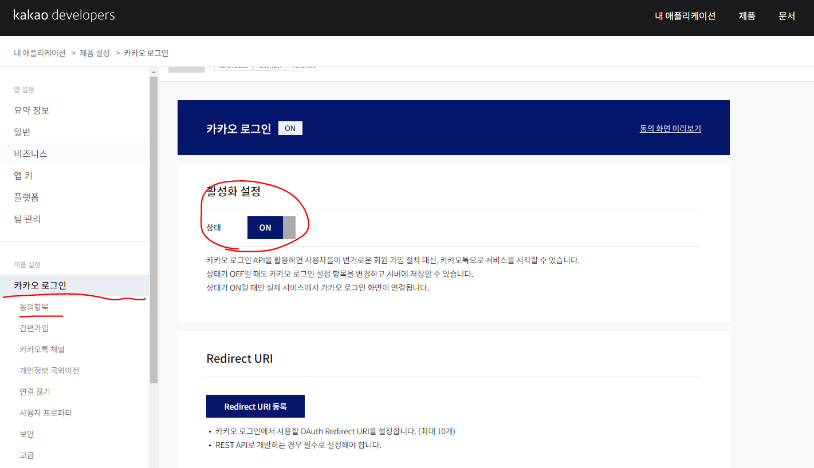

# 카카오 소셜 로그인

## 설치

```bash
yarn add @react-native-seoul/kakao-login
```


## 연결

### 키 해시

> 이 부분 나도 모르겠다 ㅠㅠ 예제에 나오는 `Xo8WBi6jzSxKDVR4drqm84yr9iU=` 씀

### SDK 인식 X

```xml
maven { url 'https://devrepo.kakao.com/nexus/content/groups/public/' }
```


### AndroidManifext.xml에 추가

```xml
<application
+  android:allowBackup="true" ...>

    ...

    <activity android:name="com.kakao.sdk.auth.AuthCodeHandlerActivity">
        <intent-filter>
            <action android:name="android.intent.action.VIEW" />
            <category android:name="android.intent.category.DEFAULT" />
            <category android:name="android.intent.category.BROWSABLE" />

            <!-- Redirect URI: "kakao{NATIVE_APP_KEY}://oauth“ -->
            <data android:host="oauth"
                  android:scheme="kakao{카카오 네이티브 앱 key를 입력해주세요}" />
        </intent-filter>
    </activity>
</application>
```

### strings.xml에 추가

```xml
<string name="kakao_app_key">your_app_key</string>
```


### kakao developers에 안드로이드 앱 추가 ( 네이티브 앱 키 사용 )

> 여기서 카카오 로그인 사용 설정 해야함

