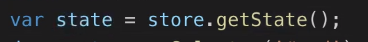

Redux

- 스토어를 만들때 state를 만든 후 reducer를 꼭 만들어야한다.

- render는 redux와 상관 없는 UI를 만들어주는 역할을 하는 "내가" 짜는 코드

- state 값이 바뀔때마다 render를 해주는 subscribe

  

- 이벤트(액션)이 발생하면 dispatch를 보낸다

- 그러면 dispatch가 reducer을 호출한다
- reducer는 state와 action을 받아서 새로운 state를 만들어주는 가공자 역할을 해준다
- state값이 바뀌면 dispatch가 subscribe를 호출 후 render를 통해 화면이 새로운 state에 맞게 갱신된다

## store 만들기

1. store를 만들면 자동으로 state가 만들어지고, reducer를 만들어줘야 한다

2. reducer는 기존의 state 값과 action을 받아야한다

   - state에 초기값이면 state를 하나 만들어준다

   

3. 값을 받아오고 싶으면 getState()

4. dispatch 보낼때 가장 중요한 요소는 type

5. reducer는 이전의 state와 actions을 받아서 변경된 state 값을 return 해준다

> 이전의 state를 바꾸는 것이 아닌 새로 복제한 newState에 새로운 값을 추가해서 return 해줘야 한다

6. store에 값이 변하면 subscribe를 통해 UI에 적용

